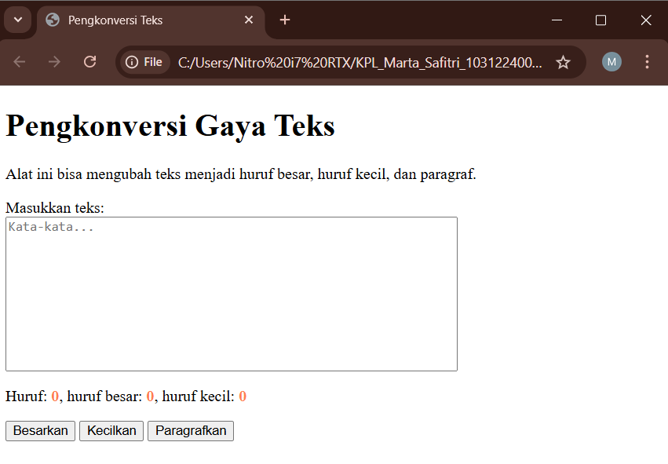

# TP03_GUI_dengan_HTML_dan_CSS

**Deskripsi Program**
Program ini membuat halaman web yang bisa mengubah teks menjadi huruf besar, huruf kecil, atau format paragraf. Saat pengguna mengetik di kotak teks, program akan:Menampilkan jumlah huruf,Menampilkan jumlah huruf besar,Menampilkan jumlah huruf kecil

Tiga tombol tersedia untuk mengubah teks:
Besarkan: mengubah semua huruf menjadi kapital
Kecilkan: mengubah semua huruf menjadi huruf kecil
Paragrafkan: mengubah huruf pertama menjadi kapital

**Output**

