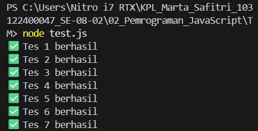

# Tugas Mandiri 02: Pemrograman JavaScript

Nama: Marta Safitri
NIM: 103122400047

## Deskripsi Program 
Program ini membuat fungsi bernama **fizzBuzz** yang menerima input berupa array. Program akan menampilkan:
-"Fizz" jika bilangan kelipatan 2
-"Buzz" jika bilangan kelipatan 7
-"FizzBuzz" jika bilangan kelipatan 14
- Jika bukan kelipatan maka menampilkan angka asli

**Output**

