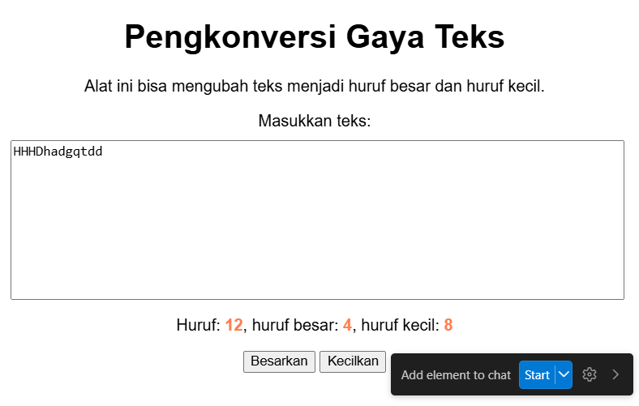

# Tugas Mandiri: GUI dengan HTML dan CSS

Marta Safitri

103122400047

S1SE-08-02

Dosen Pengampu: Yudha Islami Sulistiya

Asisten Praktikum: Adhiansyah Muhammad Pradana Farawowan, Hamid Khaeruman

## Soal
Setelah kamu menyelesaikan tugas pendahuluan (bisa buka di atas), terapkanlah fungsi untuk (1) menghitung huruf kecil yang disediakan di #hk, (2) mengubah huruf kecil ke huruf besar ketika pengguna menekan tombol #huruf-besar, dan (3) mengubah huruf besar ke huruf kecil ketika pengguna menekan tombol #huruf-kecil.
Kemudian, hapuslah fitur "Paragrafkan" dari alat.

## Kode Sumber
Tersedia di [index.css](./index.css), [index.js](./index.js), dan [index.html](./index.html)

## Output

## Deskripsi Program
Pada tugas ini dilakukan penambahan beberapa fungsi pada program pengkonversi teks dari tugas pendahuluan.
    1. Menghitung huruf kecil
    Program ditambahkan fungsi untuk menghitung jumlah huruf kecil dari teks yang dimasukkan oleh pengguna. Hasil perhitungan tersebut kemudian ditampilkan pada bagian #hk.
    2. Mengubah huruf menjadi huruf besar
    Ketika pengguna menekan tombol Besarkan, teks yang ada di dalam textarea akan diubah menjadi huruf besar semua.
    3.Mengubah huruf menjadi huruf kecil
    Ketika pengguna menekan tombol Kecilkan, teks yang ada di dalam textarea akan diubah menjadi huruf kecil semua.
    4.Menghapus fitur paragrafkan
    Pada tugas ini fitur Paragrafkan dihapus dari halaman karena tidak lagi digunakan sesuai dengan instruksi tugas.