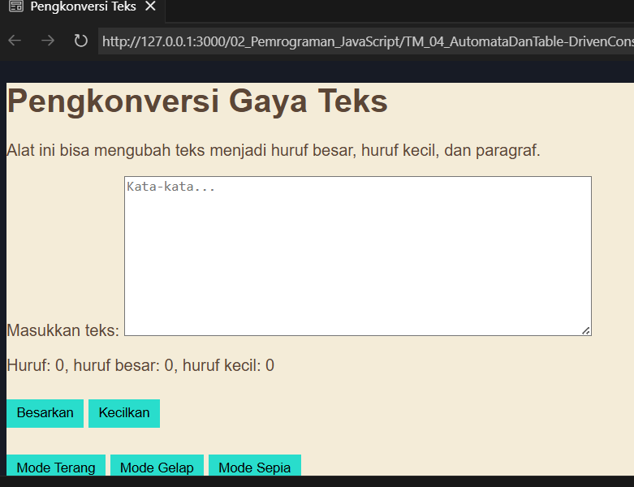

# Tugas Mandiri: Automata dan Table-Driven Construction

Marta Safitri

103122400047

S1SE-08-02

Dosen Pengampu: Yudha Islami Sulistiya

Asisten Praktikum: Adhiansyah Muhammad Pradana Farawowan, Hamid Khaeruman

## Soal
Tambahkan mode sepia dengan ketentuan:

Elemen	Warna
Latar belakang	#F4ECD8
Warna teks	#5B4636
Biarkan form tetap warna putih.

Ketentuan lainnya:
Bagian mode-div harus menaungi tiga button: light, dark, dan sepia
Bisa berpindah state secara mulus: sepia menghasilkan sepia-mode, dark menghasilkan dark-mode, dan light menghasilkan light-mode

## Kode Sumber
Tersedia di [index.css](./index.css), [index.js](./index.js), dan [index.html](./index.html)

## Output
## mode sepia: 

## Deskripsi 
Pada program ini ditambahkan fitur untuk mengubah tampilan halaman menjadi tiga mode, yaitu mode terang, mode gelap, dan mode sepia. Ketiga tombol tersebut diletakkan dalam satu bagian mode-div agar pengaturan mode lebih terorganisir.

Perubahan tampilan diatur menggunakan JavaScript dengan cara menambahkan atau menghapus class pada elemen body. Saat tombol Mode Gelap ditekan, halaman akan diberi class mode-gelap. Saat tombol Mode Sepia ditekan, halaman akan menggunakan class sepia-mode. Sedangkan tombol Mode Terang digunakan untuk menghapus kedua mode tersebut sehingga tampilan kembali seperti semula.

Dengan cara ini, setiap kali tombol ditekan hanya satu mode yang aktif, sehingga tampilan halaman bisa berpindah dengan jelas sesuai tombol terakhir yang dipilih tanpa perlu memuat ulang halaman.