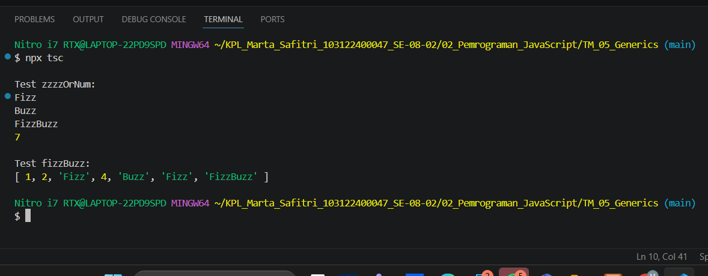

# Tugas Mandiri: GENERICS

Marta Safitri

103122400047

S1SE-08-02

Dosen Pengampu: Yudha Islami Sulistiya

Asisten Praktikum: Adhiansyah Muhammad Pradana Farawowan, Hamid Khaeruman

## Soal
Diberikan program index.js seperti ini:

// Tambah JSDoc di sini
function zzzzOrNum(value) {
    // Ubah kode di sini
}

// Tambah JSDOC di sini
function fizzBuzz(sequence) {
    // Ubah kode di sini

    const newSequence = sequence.map((e) => zzzzOrNum(e));

    return newSequence;
}

module.exports = {
    fizzBuzz: fizzBuzz,
    zzzzOrNum: zzzzOrNum,
};

Aturan FizzBuzz kali ini adalah:

1. Fungsi fizzBuzz hanya menerima larik yang semua elemennya terdiri dari bilangan bulat dan mengeluarkan larik pula yang bisa jadi bercampur string dan bilangan
2. Fungsi zzzzOrNum hanya menerima sebuah data tunggal berupa bilangan bulat dan mengembalikan "Fizz", "FizzBuzz", "Buzz", atau bilanga bulat sesuai logikanya
3. Kedua fungsi harus ada dan harus disertai JSDoc sesuai tipe data yang disiratkan dari no. 1, no. 2, dan perilaku yang diharapkan di bawah
4. fizzBuzz harus menggunakan fungsi zzzzOrNum di dalamnya

## Kode Sumber
Tersedia di [test.js](./test.js), [index.js](./index.js), dan [tsconfif.json](./tsconfig.json)

## Output

## Deskripsi Program

Pada tugas ini dibuat program FizzBuzz menggunakan dua fungsi, yaitu zzzzOrNum dan fizzBuzz. Fungsi zzzzOrNum digunakan untuk mengecek apakah suatu angka merupakan kelipatan 3, 5, atau keduanya, lalu mengembalikan nilai "Fizz", "Buzz", "FizzBuzz", atau angka tersebut. Sedangkan fungsi fizzBuzz digunakan untuk memproses sebuah array angka dengan memanggil fungsi zzzzOrNum pada setiap elemennya. Hasil akhirnya berupa array baru yang berisi angka atau string sesuai aturan FizzBuzz.
