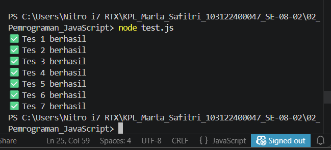

# Tugas Mandiri: Design By Contract dan Defensive Programming

Marta Safitri

103122400047

S1SE-08-02

Dosen Pengampu: Yudha Islami Sulistiya

Asisten Praktikum: Adhiansyah Muhammad Pradana Farawowan, Hamid Khaeruman

## Soal
Lindungi kode ini dari bilangan-bilangan "fizz buzz"!

Tugasmu adalah membuat fungsi yang menolak bilangan-bilangan kelipatan 3, 5, atau 15, menerima bilangan-bilangan bukan "fizz buzz", dan melempar yang bukan bilangan bulat.

function is_not_fizzbuzz(number) {
  // TODO
}

console.log(is_not_fizzbuzz(1)) // true
console.log(is_not_fizzbuzz(3)) // false
console.log(is_not_fizzbuzz(5)) // false
console.log(is_not_fizzbuzz(30)) // false
console.log(is_not_fizzbuzz(7)) // true
console.log(is_not_fizzbuzz(null)) // Lempar TypeError
console.log(is_not_fizzbuzz(NaN)) // Lempar TypeError
console.log(is_not_fizzbuzz(Infinity)) // Lempar TypeError

## Kode Sumber
Tersedia di [test.js](./index.js)

## Output

## Deskripsi Program
Kode ini tu buat ngecek apakah suatu angka bukan termasuk fizzbuzz.

Pertama, dicek dulu inputnya. Kalau bukan angka bulat (misalnya null, NaN, atau Infinity) langsung error (TypeError).
Kalau sudah pasti angka bulat, dicek apakah habis dibagi 3 atau 5.
Kalau iya berarti fizz/buzz dan hasilnya false
Kalau tidak berarti aman dan hasilnya true

