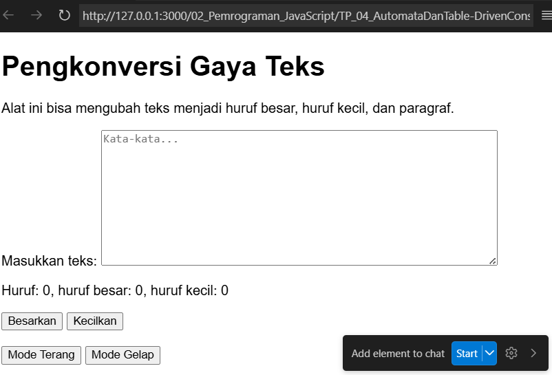
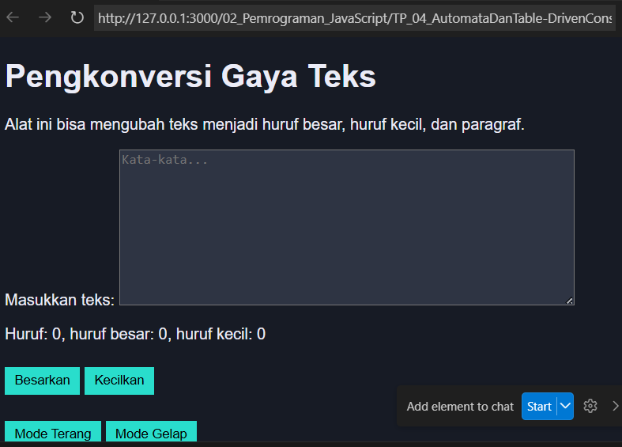

# Tugas Pendahuluan: Automata dan Table-Driven Construction

Marta Safitri

103122400047

S1SE-08-02

Dosen Pengampu: Yudha Islami Sulistiya

Asisten Praktikum: Adhiansyah Muhammad Pradana Farawowan, Hamid Khaeruman

## Soal
Tambahkan mode gelap sekaligus untuk editor-kecil dan tombol-tombolnya. Ketentuan warna untuk latar belakang editor-kecil adalah #2e3443, sementara untuk tombol adalah #29ddcc. Teks untuk tombol tetap mengikuti warna teks sebelumnya.

Untuk menghapus pinggiran tombol, nyatakan properti border untuk tidak ditunjukkan.

## Kode Sumber
Tersedia di [index.css](./index.css), [index.js](./index.js), dan [index.html](./index.html)

## Output
## mode terang: 
## mode gelap:

## Deskripsi 

Pada bagian ini ditambahkan fitur mode gelap agar tampilan halaman lebih nyaman digunakan terutama saat kondisi cahaya rendah atau malam hari.

Ketika kelas mode gelap aktif, warna latar belakang halaman berubah menjadi `#171b25` dan warna teks menjadi `#ebecf7`.

Untuk mengaktifkan dan menonaktifkan mode tersebut, ditambahkan dua tombol pada halaman yaitu Mode Terang dan Mode Gelap dengan id `tombol-terang` dan `tombol-gelap`. Kedua tombol ini akan mengubah kelas pada elemen akar dokumen (`html`) menggunakan JavaScript.

Jika tombol Mode Gelap ditekan, program akan menambahkan kelas `mode-gelap` ke elemen `html` menggunakan `classList.add()`. Sebaliknya, ketika tombol Mode Terang ditekan, kelas tersebut akan dihapus menggunakan `classList.remove()` sehingga tampilan kembali ke mode terang.

Selain itu, pada mode gelap juga dilakukan penyesuaian tampilan untuk beberapa elemen, yaitu:
- `textarea` dengan id `editor-kecil` diberi warna latar belakang `#2e3443`.
- Semua tombol diberi warna latar belakang `#29ddcc`.
- Pinggiran tombol dihilangkan dengan properti `border: none`.

Dengan cara ini, HTML, CSS, dan JavaScript bekerja bersama untuk mengubah tampilan halaman antara **mode terang** dan **mode gelap** sesuai interaksi pengguna.