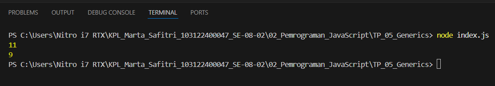

# Tugas Pendahuluan: Automata dan Table-Driven Construction

Marta Safitri

103122400047

S1SE-08-02

Dosen Pengampu: Yudha Islami Sulistiya

Asisten Praktikum: Adhiansyah Muhammad Pradana Farawowan, Hamid Khaeruman

## Soal
Ini adalah kode yang mengurus jumlah semua karakter dan jumlah huruf:

const str = "Bar bar";

let jumlahSemua = 0;
for (const c of str) { 
    jumlahSemua++; 
}
console.log(total);

let jumlahHuruf = 0;
for (const c of str) { 
    if (c === ' ') continue;
    jumlahHuruf++;
}
console.log(letters);

Bagaimana caramu hanya dengan satu fungsi generik bisa mengurus keduanya?

Agar fungsi yang kamu kerjakan benar atau tidak, berikut ini adalah kode tes yang bisa kamu tempelkan:

const str = "Bar bar bar";
...
console.log(
   hitung(str, "semua") // Harusnya 11
);

console.log(
  hitung(str, "huruf") // Harusnya 9
);

hitung(str, "huruf"); // Tidak terjadi apa-apa

## Kode Sumber
Tersedia di [index.js](./index.js)

## Output
## mode terang: 

## Deskripsi 
Pada kode tersebut dibuat sebuah fungsi bernama hitung yang digunakan untuk menghitung jumlah karakter dalam sebuah teks. Fungsi ini memiliki dua parameter, yaitu str sebagai teks yang ingin dihitung dan mode untuk menentukan cara perhitungannya.

Jika mode yang digunakan adalah "semua", maka program akan menghitung semua karakter yang ada pada teks, termasuk spasi. Sedangkan jika mode yang dipilih "huruf", maka spasi akan dilewati sehingga yang dihitung hanya huruf saja.

Dengan menggunakan satu fungsi ini, kita bisa menghitung jumlah semua karakter atau hanya huruf tanpa perlu membuat dua fungsi yang berbeda. Hasil perhitungannya kemudian ditampilkan di console menggunakan console.log.