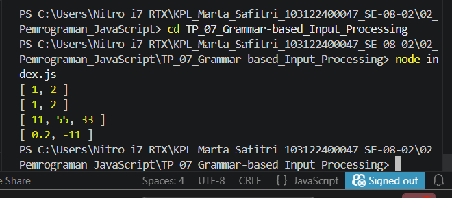

# Tugas Pendahuluan: Grammar-based Input Processing
Marta Safitri

103122400047

S1SE-08-02

Dosen Pengampu: Yudha Islami Sulistiya

Asisten Praktikum: Adhiansyah Muhammad Pradana Farawowan, Hamid Khaeruman

## Soal
Buatlah fungsi yang mengubah deretan angka bertipe string menjadi larik angka.

function toNumberArray(number) {
  // TODO
}

console.log(toNumberArray("1, 2")) // [1, 2]
console.log(toNumberArray(["1", "2"])) // [1, 2]
console.log(toNumberArray(" 11,55,33   ")) // [11, 55, 33]
console.log(toNumberArray(["0.2", "-11", "abc23"]) // [0.2, -11]

## Kode Sumber
Tersedia di [index.js](./index.js)

## Output
 

## Deskripsi 
fungsi ini buat ngubah input jadi array angka. Kalau string berarti di pisah pakai koma,spasi di bersihin, terus di ubah ke angka
Kalau array itu langsung diubah ke angka
Lalu untuk yang bukan angka bakal dibuang
Jadi intinya tu ambil angkanya aja, yang nggak valid dihapus