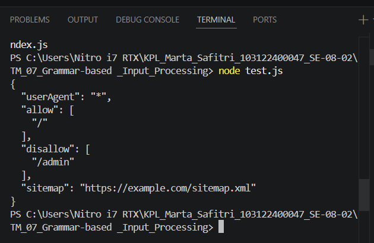

# Tugas Mandiri: Grammar-based Input Processing

Marta Safitri

103122400047

S1SE-08-02

Dosen Pengampu: Yudha Islami Sulistiya

Asisten Praktikum: Adhiansyah Muhammad Pradana Farawowan, Hamid Khaeruman

## Soal
Tugas pada kesempatan kali ini adalah membuat fungsi yang menguraikan isi robots.txt menjadi POJO (plain old JavaScript object). Empat properti yang perlu diuraikan dijabarkan di bawah berikut.

User-agent adalah nama robot perayapnya
Allow adalah daftar halaman-halaman yang boleh dirayap
Disallow adalah daftar halaman-halaman yang tidak boleh dirayap
Sitemap adalah sebuah pranala yang menunjuk pada "denah" situs web (biasanya berformat XML)
Kamu akan mengerjakannya di dalam sebuah fungsi bernama parseRobots di index.js dan. Buka direktori 07 di sini untuk mengunduh berkas yang dimaksud, berkas-berikas robots.txt di dalam direktori daftar, dan berkas pengujiannya yaitu test.js.

## Kode Sumber
Tersedia di [test.js](./test.js), [index.js](./index.js)

## Output

## Deskripsi Program
Program ini dibuat dengan cara membaca isi robots.txt baris per baris, lalu tiap baris dicek isinya. Kalau ada “User-agent”, “Allow”, “Disallow”, atau “Sitemap”, nilainya diambil setelah tanda “:”. Data allow dan disallow disimpan dalam bentuk array karena bisa lebih dari satu, sedangkan userAgent dan sitemap cukup satu nilai. Cara ini dipakai karena format robots.txt memang per baris, jadi lebih gampang diproses pakai perulangan sederhana.
