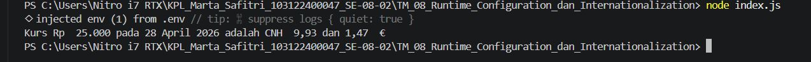

# Tugas Mandiri: Runtime Configuration dan Internationalization
Marta Safitri

103122400047

S1SE-08-02

Dosen Pengampu: Yudha Islami Sulistiya

Asisten Praktikum: Adhiansyah Muhammad Pradana Farawowan, Hamid Khaeruman

## Soal
Pada tugas ini kamu akan membuat program yang menampilkan kurs rupiah (IDR) terhadap renminbi luar Tiongkok (CNH) dan euro (EUR). Gunakan link API ini untuk mengambil data.

Tantangan

Simpanlah URL API ke dalam .env sebagai BASE_API

Gunakan Intl untuk memformat nilai mata uang dan waktu kamu mengambil data kurs.

Hapus pesan promosi dotenv

image
Lalu pastikan outputnya tampak seperti di bawah ini.

image
Ujilah dengan Rp25000, Rp50000, dan Rp100000.

## Kode Sumber
Tersedia di[index.js](./index.js)

## Output

## Deskripsi Program
Pakai .env buat URL API: Link API ditaruh di file .env pakai variabel BASE_API. Tujuannya biar rapi dan kalau linknya ganti, nggak perlu bongkar-bongkar kodingan lagi.

Ambil Data Pakai Axios: Program request data kurs terbaru dari API. Data ini yang jadi patokan buat ngitung berapa nilai CNH sama Euro-nya.

Format Rapi Pakai Intl: Biar outputnya sama persis kayak contoh, aku pakai Intl.

Intl.NumberFormat biar angka mentah otomatis ada simbol Rp, CNH, atau € lengkap sama titik komanya.

Output: Pesan promosi dotenv diilangin biar terminalnya bersih cuma nampilin hasil konversi sesuai permintaan soal.
