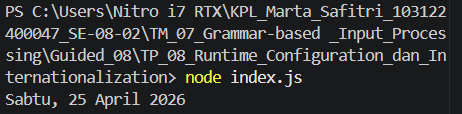

# Tugas Pendahuluan: Runtime Configuration dan Internationalization
Marta Safitri

103122400047

S1SE-08-02

Dosen Pengampu: Yudha Islami Sulistiya

Asisten Praktikum: Adhiansyah Muhammad Pradana Farawowan, Hamid Khaeruman

## Soal
Tampilkan tanggal sekarang dengan format seperti ini:

Sabtu, 18 April 2026
Nilai waktu tidak harus sama, asalkan formatnya benar dan bisa tampil di komputer terpisah pada waktu tertentu. Gunakan Intl.DateTimeFormat (bukan string manual).

## Kode Sumber
Tersedia di [index.js](./index.js)

## Output
 

## Deskripsi 
new Date(): Buat ambil jam dan tanggal sekarang banget dari laptop.

id-ID: Kode buat ngasih tau JavaScript kalau kita mau pakai format Indonesia (biar muncul "Sabtu" dan "April", bukan "Saturday" dan "April").

long: Di bagian weekday sama month kita kasih long biar namanya keluar lengkap, nggak disingkat-singkat.

formatter.format: Tinggal gabungin data tanggalnya sama format yang udah kita buat tadi, terus diprint deh ke console.