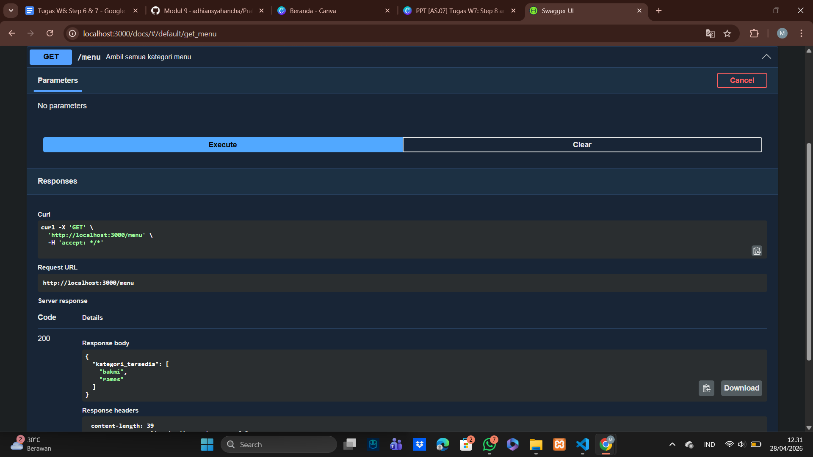

# Tugas Pendahuluan: API Design dan Construction Using Swagger
Marta Safitri

103122400047

S1SE-08-02

Dosen Pengampu: Yudha Islami Sulistiya

Asisten Praktikum: Adhiansyah Muhammad Pradana Farawowan, Hamid Khaeruman

## Soal
Buatlah satu endpoint lagi beserta dokumentasi OpenAPI-nya, yaitu GET /menu yang menampilkan daftar semua nama kategori menu yang ada.

## Kode Sumber
Tersedia di [index.js](./index.js), [swagger.js](./swagger.js)

## Output
 

## Deskripsi 
Pada soal ini dilakukan penambahan endpoint baru pada API, yaitu endpoint GET /menu yang digunakan untuk mengambil daftar kategori menu yang tersedia pada sistem. Endpoint ini bertujuan untuk memudahkan pengguna dalam melihat jenis-jenis menu tanpa harus mengakses data secara detail.

Selain itu, endpoint ini juga dilengkapi dengan dokumentasi OpenAPI agar dapat diuji dan dipahami dengan mudah melalui halaman dokumentasi API. Dengan adanya dokumentasi tersebut, pengguna dapat mengetahui format request dan response yang dihasilkan oleh endpoint ini.