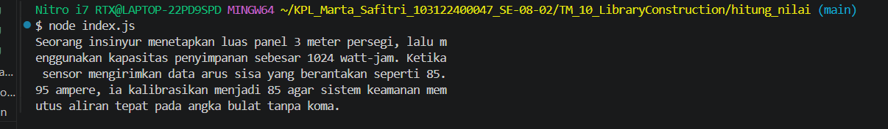

# Tugas Mandiri: Library Construction

Marta Safitri

103122400047

S1SE-08-02

Dosen Pengampu: Yudha Islami Sulistiya

Asisten Praktikum: Adhiansyah Muhammad Pradana Farawowan, Hamid Khaeruman

## Soal
Setiap berkas lib hanya memiliki satu fungsi saja.

pangkat.js berisi fungsi pangkat(x, y) yang mengembalikan nilai akhir dari x pangkat y.
bulat.js berisi fungsi bulat(x) yang mengubah bentuk bilangan non-bulat menjadi bulat (mis. -4.25 menjadi -4) .
kuadrat.js berisi fungsi kuadrat(x) yang mengembalikan nilai akar kuadrat 2 dari x.
Satu batasannya adalah fungsi-fungsi ini harus diakses dari index.js (sebagai nilai dari properti main), bukan dari lib masing-masing.

Jika sudah selesai, buatlah proyek baru lagi dan instal pustaka yang kamu buat secara lokal. Pada index.js-nya, gunakan kode ini untuk memastikan bahwa kamu berhasil melakukannya.

import { kuadrat, pangkat, bulat } from "libr";

const narasi = `Seorang insinyur menetapkan luas panel ${bulat(kuadrat(12))} meter persegi, lalu menggunakan kapasitas penyimpanan sebesar ${pangkat(2, 10)} watt-jam. Ketika sensor mengirimkan data arus sisa yang berantakan seperti 85.95 ampere, ia kalibrasikan menjadi ${bulat(85.95)} agar sistem keamanan memutus aliran tepat pada angka bulat tanpa koma.`;

/**
 * Seorang insinyur menetapkan luas panel 3 meter persegi, lalu menggunakan kapasitas penyimpanan sebesar 1024 watt-jam. Ketika sensor mengirimkan data arus sisa yang berantakan seperti 85.95 ampere, ia kalibrasikan menjadi 85 agar sistem keamanan memutus aliran tepat pada angka bulat tanpa koma.
 * /

console.log(narasi);

## Kode sumber

Tersedia di [index.js](./mtk-gampang/index.js),[package.json](./mtk-gampang/package.json), [bulat.js](./mtk-gampang/lib/bulat.js),[kuadrat.js](./mtk-gampang/lib/kuadrat.js), [pangkat.js](./mtk-gampang/lib/pangkat.js), [index.js](./hitung_nilai/index.js), [package.json](./hitung_nilai/package.json), [package-lock.jon](./hitung_nilai/package-lock.json)

## Output

## Deskripsi 
Di tugas ini, saya membuat library Node.js sendiri bernama mtk-gampang. Isinya ada tiga fungsi matematika: buat hitung pangkat, akar kuadrat, sama pembulatan angka. Semua fungsi itu dibuat di file terpisah tapi disatuin lewat satu file utama (index.js).

Terus, library ini diuji dengan cara diinstal secara lokal ke proyek baru bernama hitung_nilai. Hasilnya, kode berhasil jalan dan otomatis menghitung angka-angka di dalam narasi "insinyur" tadi dengan benar. Intinya, tugas ini berhasil ngebuktiin kalau sistem ekspor-impor antar folder sudah terhubung dan berfungsi normal.

