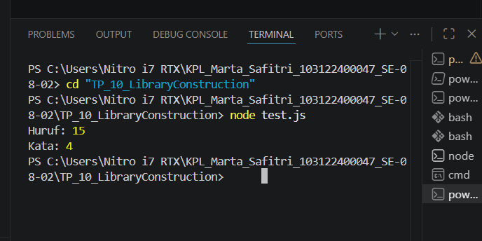

# Tugas Pendahuluan: Library Construction

Marta Safitri

103122400047

S1SE-08-02

Dosen Pengampu: Yudha Islami Sulistiya

Asisten Praktikum: Adhiansyah Muhammad Pradana Farawowan, Hamid Khaeruman

## Soal
Buatlah pustaka JavaScript yang menyediakan utilitas berupa dua fungsi yang menghitung jumlah huruf dan jumlah kata.

Kriteria:
1. Hanya alfabet A hingga Z yang dihitung (besar dan kecil)
2. Spasi tidak dihitung
3. Pustaka bisa diimpor

## Kode sumber

Tersedia di [index.js](./index.js), [test.js](./test.js), [package.json](./package.json)

## Output

## Deskripsi 
Tugas ini intinya bikin library JS buat hitung huruf (A-Z aja) sama jumlah kata. Kodingannya pakai gaya ESM (modul modern), jadi wajib ada "type": "module" di file package.json.
Logikanya simpel: buat hitung huruf, aku pakai cara hapus semua karakter yang bukan alfabet, terus sisanya baru dihitung. Kalau buat kata, tinggal aku pecah aja kalimatnya tiap ada spasi. Pas di-test running di terminal pakai node test.js, hasilnya keluar Huruf: 15 dan Kata: 4. Ini artinya library-nya sudah berhasil jalan dan fungsi import/export-nya nggak ada masala

