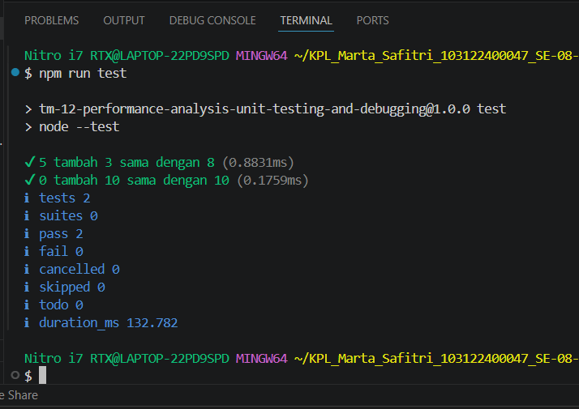

# Tugas Mandiri: Performance Analysis, Unit Testing, dan Debugging

Marta Safitri

103122400047

S1SE-08-02

Dosen Pengampu: Yudha Islami Sulistiya

Asisten Praktikum: Adhiansyah Muhammad Pradana Farawowan, Hamid Khaeruman

## Soal
Fungsi di bawah ini melakukan penjumlaha pada penghitung (counter), yang sesederhana menambahk jumlah jika kamu menekan tombol.

hitung.js

function tambahPengitung(terkini, jumlah) {
  terkini = terkini + jumlah;
  return terkini;
}
hitung.test.js

import { test } from 'node:test';
import assert from 'node:assert';
import { tambahPengitung } from './hitung.js';

test('5 tambah 3 sama dengan 8', () => {
  assert.strictEqual(tambahPengitung(5, 3), 8);
});

test('0 tambah 10 sama dengan 10', () => {
  assert.strictEqual(tambahPengitung(0, 10), 10);
});
Bisakah kamu tunjukkan apakah kode sudah benar atau bagian mana yang perlu diperbaiki beserta alasannya?

## Kode sumber

Tersedia di [hitung.js](./hitung.js), [hitung.test.js](./hitung.test.js), [package.json](./package.json)

## Output

## Deskripsi 
1. hitung.js pada code sebelumnya itu function tambahPenghitung diganta jadi export tambahPenghitung diganti export biar bisa dibaca oleh berkas pengujian. 
