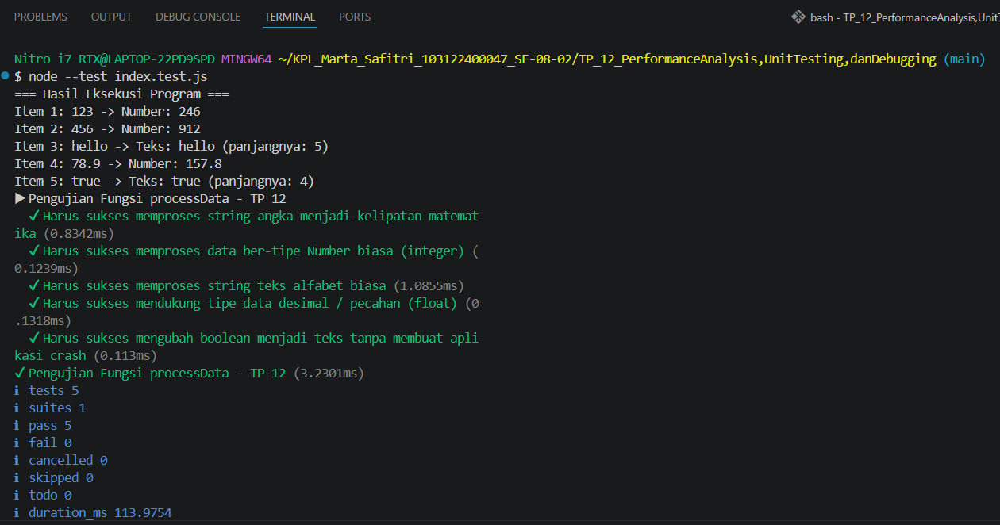

# Tugas Pendahuluan: Performance Analysis, Unit Testing, dan Debugging

Marta Safitri

103122400047

S1SE-08-02

Dosen Pengampu: Yudha Islami Sulistiya

Asisten Praktikum: Adhiansyah Muhammad Pradana Farawowan, Hamid Khaeruman

## Soal
Cobalah untuk menangkap kecacatan dalam kode ini

function main() {
  const data = [
    "123",
    456,
    "hello",
    78.9,
    true,
  ];

  for (let i = 0; i < data.length; i++) {
    const result = processData(data[i]);
    console.log(`Item ${i + 1}: ${data[i]} -> ${result}`);
  }
}

function processData(data) {
  const str = data.toLowerCase();
  const num = parseInt(str);
  if (!isNaN(num) && str === String(num)) {
    return `Number: ${num * 2}`;
  }
  return `Teks: ${str} (panjangnya: ${str.length})`;
}

main();

## Kode sumber

Tersedia di [index.js](./index.js), [index.test.js](./index.test.js), [package.json](./package.json)

## Output

## Deskripsi 
Analisis Cacat Kode (Bug)
Kode awal mengalami runtime error berupa TypeError: data.toLowerCase is not a function. Hal ini terjadi karena fungsi .toLowerCase() dipanggil secara langsung pada tipe data Number (456, 78.9) dan Boolean (true) yang ada di dalam array. Selain itu, penggunaan parseInt() menyebabkan kesalahan logika karena memotong nilai desimal 78.9 menjadi 78.

Solusi Perbaikan 
Perbaikan dilakukan dengan mengonversi input secara aman menggunakan String(data) sebelum diubah menjadi huruf kecil agar program tidak crash. Fungsi parseInt() diganti dengan Number() untuk menjaga akurasi angka desimal. Terakhir, ditambahkan kondisi pengecekan typeof untuk memisahkan validasi antara tipe numerik dan teks secara akurat.

Hasil Pengujian 
Setelah diperbaiki, kode diuji menggunakan test runner bawaan Node.js (node --test). Pengujian mencakup 5 skenario tipe data yang berbeda dan menghasilkan status PASS (0 fail). Program berhasil dieksekusi seluruhnya dan mengeluarkan output yang sesuai tanpa mengalami error.

