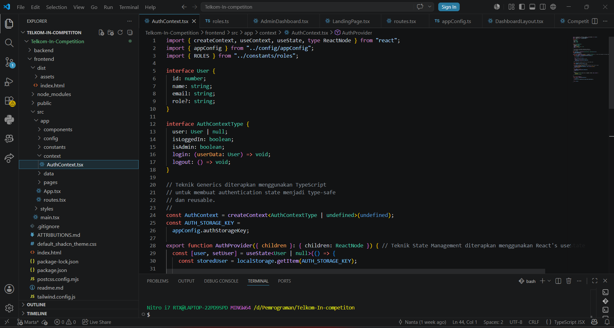

# Tugas Pendahuluan: Design Pattern Implementation

Marta Safitri

103122400047

S1SE-08-02

Dosen Pengampu: Yudha Islami Sulistiya

Asisten Praktikum: Adhiansyah Muhammad Pradana Farawowan, Hamid Khaeruman

## Soal
Bukalah repostori kode tugas besarmu dan carilah satu saja design pattern yang digunakan di dalamnya (boleh design pattern apa saja, akan direviu kasus-per-kasus). Sertakan kodenya di tugas ini dan coba jelaskan desainnya.

## Kode sumber

Tersedia di frontend/src/app/context/AuthContext.tsx

## Output

## Deskripsi 
Kode tersebut menggunakan Observer Pattern karena komponen yang memakai useAuth() akan otomatis mendapatkan update ketika data user berubah. Misalnya saat user login atau logout, tampilan seperti navbar atau dashboard langsung berubah tanpa perlu refresh halaman. Pattern ini membuat pengelolaan data authentication lebih rapi dan mudah digunakan di banyak komponen.