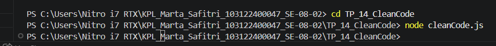

# Tugas Pendahuluan: Clean Code

Marta Safitri

103122400047

S1SE-08-02

Dosen Pengampu: Yudha Islami Sulistiya

Asisten Praktikum: Adhiansyah Muhammad Pradana Farawowan, Hamid Khaeruman

## Soal
Kode ini tampak baik dan bagus, tetapi menyalahi beberapa prinsip kode bersih. Bisakah kamu melakukan refaktorisasi? Dimodifikasi dari amrrwael/Delivery-website-Hits.

Sebagai konteks, fungsi di bawah ini menampilkan rincian pesanan di modal dan jika klik konfirmasi, sistem apa menyimpannya.

function fetchOrderDetails(orderId, token) {
    fetch(`https://example.com/api/order/${orderId}`, {
        headers: {
            'Authorization': token
        }
    })
    .then(response => {
        if (!response.ok) {
            throw new Error('Failed to fetch order details');
        }
        return response.json();
    })
    .then(order => {
        // Display order info
        const modal = document.getElementById('orderModal');
        const detailsDiv = modal.querySelector('#orderDetails');
        detailsDiv.innerHTML = '';

        const header = document.createElement('h3');
        header.textContent = `Order ID: ${order.id}`;
        detailsDiv.appendChild(header);

        const status = document.createElement('p');
        status.textContent = `Status: ${order.status}`;
        detailsDiv.appendChild(status);

        // Show modal
        modal.style.display = 'block';

        // Setup close button
        const closeBtn = modal.querySelector('.close');
        closeBtn.addEventListener('click', () => {
            modal.style.display = 'none';
        });

        // Setup confirm button
        const confirmBtn = modal.querySelector('#confirmOrderBtn');
        if (order.status === 'Delivered') {
            confirmBtn.style.display = 'none';
        } else {
            confirmBtn.addEventListener('click', () => {
                confirmOrder(order.id, token);
            });
        }
    })
    .catch(error => {
        console.error('Error:', error);
    });
}

## Kode sumber

Tersedia di [CleanCode.js](./cleanCode.js)
## Output

## Deskripsi 
Perbaikan kode pada fungsi utama dilakukan dengan menerapkan prinsip Single Responsibility, yaitu memecah satu fungsi yang awalnya terlalu panjang dan melakukan banyak pekerjaan sekaligus menjadi beberapa fungsi kecil yang lebih spesifik. Sekarang, masing" fungsi hanya fokus pada satu tugas tunggal, seperti khusus untuk mengambil data dari API, menyusun tampilan konten, atau mengatur aksi tombol. Hal ini membuat struktur program menjadi jauh lebih rapi, mudah dibaca, dan lebih gampang diperbaiki jika ke depannya ada perubahan.Sementara itu, hasil run di terminal tidak menampilkan output apa pun karena file tersebut baru berisi deklarasi atau pendefinisian fungsi saja, tanpa adanya perintah untuk memanggil atau menjalankan fungsi tersebut secara langsung. Kondisi terminal yang kosong tanpa memunculkan pesan error ini menandakan bahwa seluruh baris kode yang ditulis sudah benar secara sintaksis dan berhasil dieksekusi oleh node.js dengan aman.