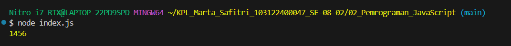

# Tugas Pendahuluan: Pemrograman JavaScript

Marta Safitri

103122400047

S1SE-08-02

Dosen Pengampu: Yudha Islami Sulistiya

Asisten Praktikum: Adhiansyah Muhammad Pradana Farawowan, Hamid Khaeruman

## Soal
Kamu sudah menulis fungsi mulOfArray. Ujilah dengan input [2, 0, 26, 28, -2], dengan output yang seharusnya adalah 1456. Jika kamu menemukan bahwa hasilnya berbeda, bisakah kamu memperbaikinya? Jika kamu menemukan bahwa hasilnya sama, bisakah kamu menjelaskan mengapa demikian?

## Kode sumber

Tersedia di [index.js](./02_Pemrograman_JavaScript/TP_02_Pemrograman_JavaScript/index.js)

## Output

## Deskripsi 
Program ini menjalankan perkalian semua bilangan positif dalam larik (_array_). Ini akan bekerja untuk bilangan positif, nol, dan negatif.
Hasilnya bisa 1456 karena fungsinya hanya mengalikan angka yang lebih dari 0 saja.Di dalam array ada angka:[2, 0, 26, 28, -2].Tapi di dalam perulangan ada syarat: angka harus lebih besar dari 0 supaya bisa dikalikan.
Artinya, angka 0 dan -2 tidak ikut dihitung karena tidak memenuhi syarat.

